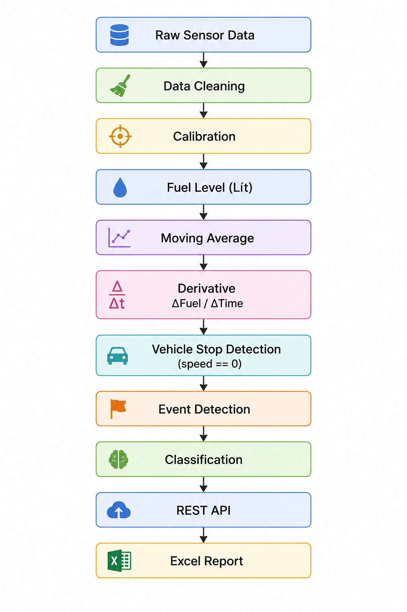

# ⛽ FuelSentinel-AI
### Hệ thống phát hiện sự kiện nạp và rút trộm nhiên liệu theo thời gian thực sử dụng Trí tuệ nhân tạo
<!-- 
<p align="center">
    
</p> -->

---

## Giới thiệu

FuelSentinel-AI là hệ thống giám sát nhiên liệu theo thời gian thực được xây dựng nhằm phát hiện các sự kiện **nạp nhiên liệu** và **rút trộm nhiên liệu** từ dữ liệu cảm biến trên phương tiện.

Không giống các hệ thống giám sát sử dụng camera hoặc xử lý hình ảnh, FuelSentinel-AI khai thác trực tiếp chuỗi dữ liệu thời gian thực từ cảm biến nhiên liệu, GPS và tốc độ xe để phát hiện các biến động bất thường của nhiên liệu.

Hệ thống được xây dựng theo hướng:

- Phân tích chuỗi thời gian (Time Series Analysis)
- Phát hiện sự kiện (Event Detection)
- Machine Learning nhẹ
- Hoạt động thời gian thực (Real-time Processing)
- Dễ triển khai trên hệ thống quản lý đội xe (Fleet Management)

---

# Mục tiêu

Hệ thống cần phát hiện chính xác các trạng thái sau:

- Normal Driving (Tiêu hao nhiên liệu bình thường)
- Idle (Xe dừng)
- Refuel (Nạp nhiên liệu)
- Fuel Theft (Rút trộm nhiên liệu)

Đầu ra của hệ thống gồm:

- Danh sách sự kiện
- API thời gian thực
- Báo cáo Excel
- Dữ liệu phục vụ Dashboard

---

# Kiến trúc tổng thể


---

# Bản chất của bài toán

Đây **không phải** là bài toán Computer Vision hay Image Classification.

Thay vào đó, FuelSentinel-AI thuộc nhóm bài toán:

> **Time Series Event Detection**

Trong đó hệ thống cần phân tích chuỗi dữ liệu cảm biến theo thời gian để phát hiện các sự kiện bất thường.

Nguồn dữ liệu đầu vào bao gồm:

| Thuộc tính | Ý nghĩa |
|------------|----------|
| Time | Thời gian |
| Fuel | Mức nhiên liệu |
| Speed | Vận tốc xe |
| GPS | Vị trí xe |

Ví dụ dữ liệu:

| Time | Fuel | Speed |
|---------|---------|---------|
|08:00:00|50.2|40|
|08:00:10|50.1|38|
|08:00:20|50.0|35|
|08:00:30|49.9|0|
|08:00:40|54.5|0|

Trong trường hợp trên:

- Xe đã dừng (Speed = 0)
- Mức nhiên liệu tăng đột biến

⇒ Sự kiện **Refuel**

---

Ví dụ khác

| Time | Fuel | Speed |
|---------|---------|---------|
|08:10:00|42.1|0|
|08:10:10|41.9|0|
|08:10:20|37.2|0|

Trong trường hợp này

- Xe đang dừng
- Nhiên liệu giảm rất nhanh

⇒ Sự kiện **Fuel Theft**

---

# Luồng xử lý của hệ thống

Pipeline của hệ thống được thiết kế như sau:



Giải thích các bước:

| Bước | Mô tả |
|-------|-------|
| Data Cleaning | Loại bỏ dữ liệu lỗi, thiếu và nhiễu |
| Calibration | Chuyển đổi giá trị ADC sang đơn vị lít |
| Moving Average | Làm mượt tín hiệu cảm biến |
| Derivative | Tính tốc độ thay đổi nhiên liệu |
| Stop Detection | Xác định xe có đang dừng hay không |
| Event Detection | Phát hiện các biến động bất thường |
| Classification | Phân loại trạng thái của xe |
| API | Cung cấp dữ liệu thời gian thực |
| Excel Report | Xuất báo cáo sự kiện |

---

# Feature Engineering

Đề tài yêu cầu tính:

> ΔFuel / ΔTime

Tuy nhiên để tăng độ chính xác của mô hình, hệ thống sẽ xây dựng nhiều đặc trưng hơn.

| Feature | Ý nghĩa |
|----------|---------|
| Fuel Difference | ΔFuel |
| Fuel Rate | ΔFuel / ΔTime |
| Average Fuel Rate | Trung bình tốc độ thay đổi |
| Moving Average | Làm mượt tín hiệu |
| Rolling Mean | Trung bình cửa sổ |
| Rolling Std | Độ lệch chuẩn cửa sổ |
| Vehicle Acceleration | Gia tốc |
| Vehicle Stop Duration | Thời gian xe dừng |
| Fuel Jump | Biến thiên nhiên liệu |
| Time Since Last Stop | Thời gian kể từ lần dừng trước |
| Linear Regression Slope | Hệ số góc hồi quy |

Các đặc trưng này được thiết kế độc lập với mô hình AI, giúp dễ dàng mở rộng hoặc thay thế thuật toán trong tương lai.

---

# Phân loại trạng thái

Hệ thống phân loại thành bốn trạng thái:

| State | Điều kiện | Ý nghĩa |
|---------|------------|---------|
|0|Speed > 0|Normal Driving|
|1|Speed = 0 và Fuel ổn định|Idle|
|2|Speed = 0 và Fuel tăng nhanh|Refuel|
|3|Speed = 0 và Fuel giảm nhanh|Fuel Theft|

Biểu diễn trực quan:


---

# Vai trò của Linear Regression

Mặc dù đề tài đề cập đến Linear Regression, mục đích chính không phải để dự đoán giá trị nhiên liệu.

Linear Regression được sử dụng để ước lượng **độ dốc (Slope)** của chuỗi dữ liệu nhiên liệu trong một khoảng thời gian.

Mô hình hồi quy:

```
y = ax + b
```

Trong đó:

- a là hệ số góc (Slope)

Ý nghĩa:

|Slope|Ý nghĩa|
|------|--------|
|a ≈ 0|Fuel gần như không đổi|
|a > 0|Đang nạp nhiên liệu|
|a < 0|Fuel giảm|

Sau khi tính được Slope, hệ thống sử dụng các ngưỡng (Threshold) kết hợp với trạng thái vận tốc để đưa ra quyết định phân loại sự kiện.

---

# Phân biệt tiêu hao và rút trộm

Đây là phần quan trọng nhất của bài toán.

Nếu chỉ quan sát Fuel giảm thì chưa thể kết luận xe bị rút trộm.

Ví dụ:

Fuel giảm trong khi xe đang chạy:

```
Speed > 0

Fuel giảm từ từ
```

⇒ Tiêu hao bình thường.

Trong khi đó:

```
Speed = 0

Fuel giảm nhanh
```

⇒ Fuel Theft.

Do đó, tốc độ xe đóng vai trò là điều kiện tiên quyết để phân biệt giữa tiêu hao tự nhiên và hành vi rút trộm nhiên liệu.

---

# Thuật toán dự kiến

Theo mức độ từ đơn giản đến nâng cao:

|Level|Thuật toán|
|-------|-----------|
|1|Rule-based|
|2|Linear Regression|
|3|Decision Tree|
|4|Random Forest|
|5|XGBoost|
|6|LSTM|
|7|Transformer Time Series|

Trong phạm vi đề tài hiện tại, phương pháp Rule-based kết hợp Linear Regression được xem là phù hợp nhất vì:

- Dễ giải thích
- Hoạt động nhanh
- Đáp ứng yêu cầu thời gian thực
- Không cần dữ liệu huấn luyện quá lớn

Các mô hình Machine Learning nâng cao sẽ được sử dụng để so sánh và đánh giá hiệu năng trong các giai đoạn phát triển tiếp theo.

---

# Thiết kế API

## POST /sensor

Nhận dữ liệu cảm biến từ thiết bị.

### Request

```json
{
    "device_id":"VN001",
    "time":"2026-07-14 10:15:00",
    "fuel":48.6,
    "speed":0
}
```

### Response

```json
{
    "state":"Fuel Theft",
    "confidence":0.97
}
```

---

## GET /events

Trả về danh sách các sự kiện đã phát hiện.

```json
[
    {
        "time":"2026-07-14 10:15:00",
        "event":"Refuel",
        "amount":12.5
    }
]
```

---

## GET /report

Sinh báo cáo Excel tổng hợp các sự kiện.

---

# Báo cáo Excel

Ví dụ:

|Time|Vehicle|Fuel Before|Fuel After|Amount|Event|
|---------|----------|------------|-----------|-----------|------------|
|08:00|29A12345|40|52|12|Refuel|
|11:30|29A12345|37|30|-7|Fuel Theft|

---

# Cấu trúc thư mục

```
FuelSentinel-AI
│
├── configs/
├── data/
│   ├── raw/
│   ├── processed/
│   └── sample/
│
├── docs/
├── notebooks/
├── reports/
├── scripts/
├── src/
│   ├── api/
│   ├── calibration/
│   ├── preprocessing/
│   ├── features/
│   ├── detection/
│   ├── models/
│   └── reporting/
│
├── tests/
│
├── README.md
├── requirements.txt
└── pyproject.toml
```

---

# Lộ trình phát triển

- Giai đoạn 1: Khởi tạo dự án và phân tích dữ liệu.
- Giai đoạn 2: Tiền xử lý dữ liệu và hiệu chuẩn cảm biến.
- Giai đoạn 3: Xây dựng bộ đặc trưng và thuật toán phát hiện sự kiện.
- Giai đoạn 4: Huấn luyện và đánh giá mô hình Machine Learning.
- Giai đoạn 5: Xây dựng REST API và xuất báo cáo Excel.
- Giai đoạn 6: Triển khai thời gian thực và tích hợp Dashboard.

---

# Công nghệ dự kiến

- Python
- Pandas
- NumPy
- Scikit-learn
- FastAPI
- Uvicorn
- OpenPyXL
- Matplotlib
- Joblib

---

# Tác giả

**Nguyễn Quang Vinh**
**Nguyễn Thị Thanh Trà**
**Nguyễn Thị Quỳnh Hương**

Trường Đại học Đại Nam