# FuelSentinel-AI
### Hệ thống phát hiện sự kiện nạp và rút trộm nhiên liệu theo thời gian thực sử dụng Trí tuệ nhân tạo

<p align="center">
    
</p>

## 1. Giới thiệu

### 1.1. Tổng quan
FuelSentinel-AI là hệ thống giám sát nhiên liệu theo thời gian thực, phát hiện các sự kiện **Driving, Idle, Refuel và Fuel Theft** từ dữ liệu cảm biến (Fuel, Speed, GPS). Hệ thống kết hợp xử lý tín hiệu, trích xuất đặc trưng thống kê và mô hình học máy để tăng độ chính xác, giảm cảnh báo giả.

### 1.2. Bản chất bài toán
Đây là bài toán **Time Series Event Detection**: liên tục phân tích luồng dữ liệu cảm biến để phát hiện sự kiện bất thường, xác định thời điểm bắt đầu, kết thúc, và lượng nhiên liệu thay đổi.


> **Time Series Event Detection**

Trong đó hệ thống cần phân tích chuỗi dữ liệu cảm biến theo thời gian để phát hiện các sự kiện bất thường.

Nguồn dữ liệu đầu vào bao gồm:

| Thuộc tính | Ý nghĩa |
|------------|----------|
| Time | Thời gian |
| Fuel | Mức nhiên liệu |
| Speed | Vận tốc xe |
| GPS | Vị trí xe |

Ví dụ dữ liệu:

| Time | Fuel | Speed |
|---------|---------|---------|
|08:00:00|50.2|40|
|08:00:10|50.1|38|
|08:00:20|50.0|35|
|08:00:30|49.9|0|
|08:00:40|54.5|0|

Trong trường hợp trên:

- Xe đã dừng (Speed = 0)
- Mức nhiên liệu tăng đột biến

⇒ Sự kiện **Refuel**

---

Ví dụ khác

| Time | Fuel | Speed |
|---------|---------|---------|
|08:10:00|42.1|0|
|08:10:10|41.9|0|
|08:10:20|37.2|0|

Trong trường hợp này

- Xe đang dừng
- Nhiên liệu giảm rất nhanh

⇒ Sự kiện **Fuel Theft**

### 1.3. Mục tiêu
- Xây dựng pipeline tiền xử lý dữ liệu sạch, bảo toàn tín hiệu thật.
- Trích xuất đặc trưng và gán nhãn tự động dựa trên luật chuyên gia.
- Huấn luyện mô hình phân loại trạng thái vận hành.
- Triển khai hệ thống thời gian thực với Dashboard, API, báo cáo Excel.

---

## 2. Kiến trúc tổng thể


---

## 3. Chuẩn bị dữ liệu và tiền xử lý

### 3.1. Dữ liệu đầu vào
Dữ liệu từ cảm biến gồm: `timestamp`, `fuel`, `speed`, `latitude`, `longitude`, `car_id`.  

| FuelTime            | FuelLevel | Lat      | Lng       | Address                                      | Speed | car_id |
|---------------------|-----------|----------|-----------|----------------------------------------------|-------|--------|
| 2025-11-19 23:00:29 | 0.0       | 21.682785| 104.951149| Xã Văn Tiến, Thành phố Yên Bái, Yên Bái      | 0     | Car 1  |
| 2025-11-19 23:00:59 | 191.4     | 21.682844| 104.95121 | Xã Văn Tiến, Thành phố Yên Bái, Yên Bái      | 0     | Car 1  |
| 2025-11-19 23:05:59 | 190.9     | 21.682844| 104.95121 | Xã Văn Tiến, Thành phố Yên Bái, Yên Bái      | 0     | Car 1  |
| 2025-11-19 23:10:59 | 191.3     | 21.682844| 104.95121 | Xã Văn Tiến, Thành phố Yên Bái, Yên Bái      | 0     | Car 1  |
| 2025-11-19 23:15:59 | 191.1     | 21.682844| 104.95121 | Xã Văn Tiến, Thành phố Yên Bái, Yên Bái      | 0     | Car 1  |
| 2025-11-19 23:20:59 | 190.8     | 21.682844| 104.95121 | Xã Văn Tiến, Thành phố Yên Bái, Yên Bái      | 0     | Car 1  |


### 3.2. Bước 1: Sensor Data Cleaning

**Mục đích:** Loại bỏ lỗi cảm biến chắc chắn, không làm mịn tín hiệu, bảo toàn mọi biến động thực tế.  
**Nguyên tắc:** Chỉ sửa khi có bằng chứng rõ ràng, ghi log mọi quyết định.

**Các bước xử lý (theo thứ tự GPS → Speed → Fuel):**
1. **GPS = (0,0):** Nội suy các đoạn mất tín hiệu ngắn (1‑2 điểm), giữ nguyên đoạn dài nếu là dừng thật.
2. **Speed = 0 mâu thuẫn GPS:** Chỉ sửa khi điểm 0 cô lập giữa các điểm có Speed > 5 km/h.
3. **Fuel = 0:** Chỉ sửa điểm 0 đơn lẻ với điều kiện hai bên gần nhau.
4. **Nhiễu Fuel > 0 (spike):** Dùng Hampel gợi ý, kiểm tra hình dạng, trạng thái xe và xu hướng trước khi sửa.
5. **Gắn cờ sự kiện (không sửa):** Đánh dấu các đoạn giảm/tăng đơn điệu vượt ngưỡng là `event: possible fuel theft` hoặc `event: refueling detected`.

**Kết quả thực tế** trên tập 285.683 dòng:
- Tổng số dòng sửa: 850 (0,3%).  
- Fuel spike bị từ chối sửa: 12.122.  
- Speed=0 được giữ nguyên: 255.802.  
- Sự kiện được gắn cờ (không sửa): 59 Theft, 32 Refuel.  
- Sau cleaning: không còn Fuel < 0, Speed < 0, GPS (0,0), timestamp đảo ngược.

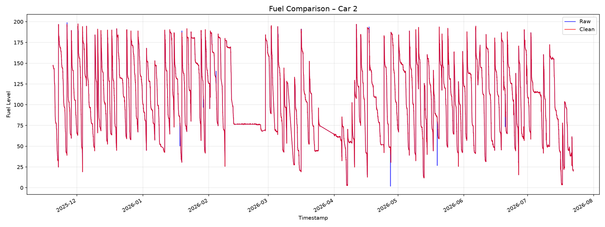

### 3.3. Bước 2: Segment Detection

**Mục đích:** Chia chuỗi dữ liệu thành các segment có hành vi đồng nhất dựa trên 4 trạng thái: Moving, Stationary‑Stable, Stationary‑FuelUp, Stationary‑FuelDown.

**Các bước chính:**
- Tính **GPS displacement** và **Behavior Score**.
- Tính xu hướng nhiên liệu bằng hồi quy cửa sổ 9 điểm.
- Tổ hợp thành 4 trạng thái hành vi (ưu tiên Moving cao nhất).
- Sử dụng bộ lọc trễ (3 điểm) để ổn định trạng thái.
- Tạo ranh giới segment khi có **Time Gap > 30 phút** hoặc **behavior_state thay đổi**.
- Gộp segment ngắn (bảo vệ FuelUp/FuelDown), gộp các segment liền kề cùng trạng thái, và **tách đuôi sau đỉnh FuelUp** (nếu có).

**Kết quả thực tế** trên 4 xe:
- Tổng số segment: 3.966  
- Trung vị độ dài: 25 điểm (~124 phút)  
- Phân bố trạng thái: Moving 39%, Stationary‑Stable 29%, Stationary‑FuelDown 23%, Stationary‑FuelUp 9%  
- Time Gap hình thành: 396 segment  
- Tách đuôi FuelUp Peak Tail Split: 2 lần

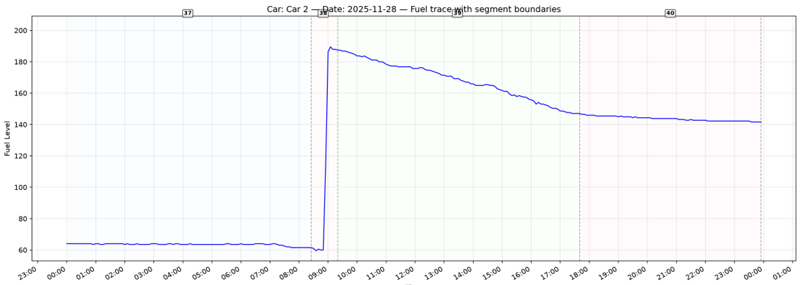

### 3.4. Bước 3: Segment Feature Extraction

**Mục đích:** Biến mỗi segment thành vector 22 đặc trưng cố định.

**Bảng 3.1. 22 đặc trưng của segment**

| Nhóm | Đặc trưng | Ý nghĩa |
|------|-----------|---------|
| Thông tin | duration_min, sample_count, movement_state | Thời gian, số mẫu, chuyển động chủ đạo |
| Fuel Level | fuel_start, fuel_end, fuel_change, fuel_mean, fuel_std | Mức nhiên liệu và thay đổi |
| Fuel Trend | fuel_slope, trend_r2, trend_rmse | Xu hướng và độ tin cậy của xu hướng |
| Fuel Dynamics | max_drop, max_rise, drop_count, rise_count | Bước nhảy và số lần tăng/giảm |
| Fuel Stability | fuel_range, fuel_mad, oscillation_count | Biên độ, độ ổn định, dao động |
| GPS | total_distance | Quãng đường di chuyển |
| Speed | speed_mean, speed_max, speed_zero_ratio | Tốc độ trung bình, tối đa, tỷ lệ dừng |

**Kết quả thực tế** trên 3.966 segment:
- Không có feature hằng số.  
- Một số cặp tương quan cao (duration_min ~ sample_count, fuel_std ~ fuel_range, drop_count ~ oscillation_count,…) cần cân nhắc giảm đa cộng tuyến khi huấn luyện.  
- 549 segment quá ngắn (<5 điểm), 37 segment chỉ có 1 điểm.

### 3.5. Bước 4: Rule‑based State Classification

**Mục đích:** Gán nhãn cuối cùng cho từng segment sử dụng luật chuyên gia, không phụ thuộc nhãn thủ công.

**Thứ tự ưu tiên:** Refuel → Theft → Idle → Driving.

**Bảng 3.2. Tóm tắt các luật gán nhãn**

| Nhãn | Điều kiện | Confidence |
|------|-----------|------------|
| Refuel | fuel_change ≥ 5L hoặc max_rise ≥ 10L | 0.95 (1.0 nếu >50L) |
| Theft | speed_zero_ratio ≥ 0.98, duration ≤ 120 phút, và một trong: fuel_change ≤ -8L, rate ≤ -15L/h, max_drop ≥ 8L | 0.85 (1.0 nếu >50L) |
| Idle | speed_zero_ratio ≥ 0.98, duration > 30 phút, $|fuel\_change|$ ≤ 1.5L | 0.90 |
| Driving | total_distance > 100m hoặc speed_mean > 5 km/h, hoặc còn lại | 0.70–0.95 (động) |

**Kết quả thực tế** trên 3.966 segment:
- Driving: 79.8%, Refuel: 11.2%, Idle: 6.1%, Theft: 2.8%, NULL: 0.1%  
- Confidence trung bình: Refuel 0.97, Idle 0.90, Theft 0.86, Driving 0.83.

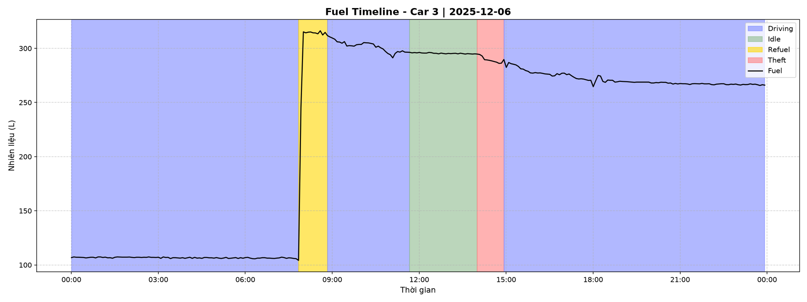

### 3.6. Bước 5: Feature Fusion – Tạo tập huấn luyện

**Mục đích:** Hợp nhất dữ liệu điểm, đặc trưng và nhãn thành một bảng duy nhất.

**Kết quả:**
- Số dòng: 216.209 (khớp 100% với dữ liệu sau cleaning)  
- Không có dòng không khớp nhãn, không trùng lặp  
- Phân phối nhãn: Driving 187.583, Idle 16.710, Refuel 10.799, Theft 1.107, NULL 10  
- Một số đặc trưng có NaN (segment 1 điểm), sẽ xử lý ở bước tiền xử lý huấn luyện

---

## 4. Huấn luyện mô hình Machine Learning

### 4.1. Vai trò của mô hình Machine Learning

Trong hệ thống phát hiện trạng thái phương tiện, mô hình Machine Learning được sử dụng để học các **mẫu hành vi (behavior patterns)** từ dữ liệu cảm biến theo thời gian. Mô hình không trực tiếp tạo ra hoặc xác nhận một Event mà thực hiện nhiệm vụ **phân loại trạng thái của từng cửa sổ dữ liệu đầu vào**.

Đầu ra của mô hình là vector xác suất tương ứng với bốn trạng thái:

* **Driving:** phương tiện đang di chuyển.
* **Idle:** phương tiện đang dừng.
* **Refuel:** phương tiện đang được tiếp nhiên liệu.
* **Theft:** phát hiện dấu hiệu mất nhiên liệu bất thường.

Với mỗi cửa sổ dữ liệu, mô hình thực hiện quá trình trích xuất đặc trưng, kết hợp thông tin giữa các nhánh đầu vào và đưa qua lớp phân loại cuối cùng. Kết quả đầu ra có dạng:

$$
P = [P_{Driving},P_{Idle},P_{Refuel},P_{Theft}]
$$

trong đó tổng các xác suất bằng 1:

$$
\sum_{i=1}^{4}P_i=1
$$

Trạng thái có xác suất lớn nhất được sử dụng làm kết quả dự đoán của mô hình. Kết quả này sau đó được truyền đến tầng **Event Tracker và các cơ chế hậu xử lý** để kiểm tra tính ổn định và các điều kiện vật lý trước khi xác nhận một sự kiện thực tế.

Do đó, kiến trúc hệ thống được phân tách thành hai tầng chính:

1. **Machine Learning:** học và phân loại mẫu hành vi.
2. **Event Processing:** xác nhận, duy trì, kết thúc và hiệu chỉnh thời điểm của Event.

Cách phân tách này giúp hạn chế việc phụ thuộc hoàn toàn vào một dự đoán đơn lẻ của mô hình và phù hợp với yêu cầu xử lý dữ liệu theo thời gian thực.

---

### 4.2. Dữ liệu đầu vào cho quá trình huấn luyện

Dữ liệu đầu vào của mô hình được xây dựng theo kiến trúc **đa nhánh (Multi-Branch Architecture)**.
Hai loại thông tin được sử dụng đồng thời gồm **chuỗi tín hiệu thời gian** và **vector đặc trưng thống kê của Segment**. Mỗi mẫu gồm hai nhánh:
- **Chuỗi thời gian (Temporal Sequence):** Fuel, Speed, GPS (đã chuyển đổi thành distance_step, bearing).
- **Vector đặc trưng (Segment Features):** 22 đặc trưng thống kê.

---

### 4.3. Benchmark các kiến trúc Machine Learning

Để lựa chọn kiến trúc phù hợp, hệ thống tiến hành benchmark **9 mô hình học sâu** trên cùng tập dữ liệu và cùng quy trình đánh giá.

Các kiến trúc được so sánh gồm:

* CNN-GRU
* GRU
* BiGRU
* TCN
* GRU-Attention
* LSTM-Attention
* CNN-BiLSTM
* BiLSTM
* Transformer

Các mô hình được đánh giá dựa trên Accuracy, F1-score, Balanced Accuracy, số lượng tham số, kích thước mô hình và thời gian huấn luyện.

**Bảng 4.1. Kết quả benchmark các kiến trúc**

|  Rank | Model          |     Score |   Accuracy |         F1 | Balanced Accuracy |      Params | Size (MB) | Train Time (s) |
| ----: | -------------- | --------: | ---------: | ---------: | ----------------: | ----------: | --------: | -------------: |
| **1** | **CNN-GRU**    | **100.0** | **0.8502** | **0.8433** |        **0.6546** | **386,628** |  **1.47** |    **1581.14** |
|     2 | GRU            |      99.0 |     0.8535 |     0.8360 |            0.5832 |     313,092 |      1.19 |        1541.57 |
|     3 | BiGRU          |      92.2 |     0.8535 | **0.8466** |            0.6365 |     594,692 |      2.27 |        1578.72 |
|     4 | TCN            |      86.9 |     0.8350 |     0.8060 |            0.5234 |     619,588 |      2.36 |        2730.20 |
|     5 | GRU-Attention  |      77.3 |     0.8468 |     0.8402 |            0.6254 |     793,092 |      3.03 |        3453.25 |
|     6 | LSTM-Attention |      66.2 |     0.8401 |     0.8221 |            0.5606 |     926,212 |      3.53 |        3456.39 |
|     7 | CNN-BiLSTM     |      52.5 |     0.8114 |     0.7696 |            0.4523 |     880,708 |      3.36 |        1614.59 |
|     8 | BiLSTM         |      48.0 |     0.7963 |     0.7341 |            0.3422 |     727,812 |      2.78 |        1584.16 |
|     9 | Transformer    |      16.8 |     0.7475 |     0.6395 |            0.2500 |     758,020 |      2.89 |        2112.39 |

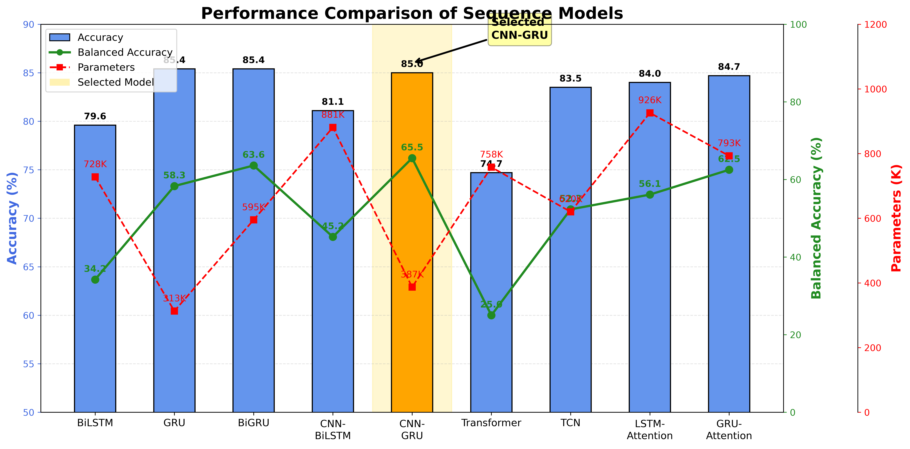

**Nhận xét kết quả Benchmark**

Kết quả benchmark cho thấy các kiến trúc dựa trên recurrent neural network có khả năng xử lý bài toán tốt hơn so với Transformer trong điều kiện dữ liệu và kích thước mô hình hiện tại.

CNN-GRU đạt **Score 100.0**, đồng thời đạt Accuracy **0.8502**, F1 **0.8433** và Balanced Accuracy **0.6546**. Mô hình có kích thước khoảng **1,47 MB** với 386.628 tham số.

GRU có Accuracy cao hơn CNN-GRU một khoảng nhỏ, đạt 0.8535, tuy nhiên Balanced Accuracy chỉ đạt 0.5832. Điều này cho thấy Accuracy cao hơn không đồng nghĩa với khả năng phân loại đồng đều giữa các lớp.

BiGRU đạt F1 **0.8466**, cao hơn CNN-GRU ở chỉ số F1, nhưng số lượng tham số lên tới 594.692 và kích thước mô hình 2,27 MB.

Trong khi đó, Transformer đạt Accuracy 0.7475, F1 0.6395 và Balanced Accuracy 0.2500. Kết quả này thấp hơn đáng kể so với các kiến trúc recurrent trong cùng điều kiện benchmark.

Từ kết quả trên, **CNN-GRU được lựa chọn làm kiến trúc chính** nhờ sự cân bằng giữa khả năng phân loại, khả năng xử lý chuỗi, số lượng tham số và kích thước mô hình.

---

### 4.4. Benchmark các phương pháp Fusion

Sau khi lựa chọn kiến trúc CNN-GRU, một thí nghiệm riêng được thực hiện để đánh giá phương pháp kết hợp giữa **Temporal Features** và **Segment Statistical Features**.

Ba phương pháp Fusion được benchmark gồm:

* **Concat Fusion:** nối trực tiếp hai vector đặc trưng.
* **Add Fusion:** cộng hai vector đặc trưng.
* **Gate Fusion:** sử dụng cơ chế cổng để điều chỉnh đóng góp của từng nhánh.

Các phương pháp được đánh giá trên cùng tập Test.

**Bảng 4.2. Kết quả benchmark các phương pháp Fusion**

| Fusion Method | Test Accuracy | F1 Weighted | Balanced Accuracy |    F1 Idle |   F1 Theft |
| ------------- | ------------: | ----------: | ----------------: | ---------: | ---------: |
| **Concat**    |    **0.7778** |  **0.7254** |        **0.3611** | **0.0625** | **0.2381** |
| Add           |        0.7643 |      0.7138 |            0.3477 |     0.0000 |     0.2162 |
| Gate          |        0.7189 |      0.6907 |            0.3405 |     0.0000 |     0.1282 |

**Nhận xét Benchmark Fusion**

Kết quả cho thấy **Concat Fusion** đạt kết quả tốt nhất trong ba phương pháp được benchmark. Accuracy đạt 0.7778, F1 Weighted đạt 0.7254 và Balanced Accuracy đạt 0.3611.

Đặc biệt, Concat Fusion là phương pháp duy nhất trong ba phương pháp đạt F1 khác 0 đối với lớp Idle, với F1 Idle bằng **0.0625**. F1 Theft cũng đạt **0.2381**, cao hơn Add và Gate.

Add Fusion có kết quả thấp hơn Concat ở tất cả các chỉ số chính. Trong khi đó, Gate Fusion có Accuracy 0.7189 và Balanced Accuracy 0.3405, là kết quả thấp nhất trong ba phương pháp.

Kết quả benchmark cho thấy việc kết hợp hai nhánh đặc trưng cần giữ lại đầy đủ thông tin của từng nhánh thay vì trực tiếp cộng các vector đặc trưng. Concat Fusion đáp ứng tốt hơn yêu cầu này trong cấu hình benchmark.

Tuy nhiên, Concat, Add và Gate đều cho kết quả còn thấp đối với các lớp thiểu số. Do đó, hệ thống cuối cùng sử dụng cơ chế **Learnable Weighted Fusion** để cho phép mô hình tự học trọng số đóng góp của từng nguồn đặc trưng thay vì sử dụng trọng số cố định.

---

### 4.5. Kiến trúc CNN-GRU cuối cùng

Dựa trên kết quả benchmark kiến trúc và Fusion, mô hình CNN-GRU được lựa chọn làm mô hình cuối cùng.

Kiến trúc bao gồm năm thành phần chính:

1. **CNN Encoder**
2. **BiGRU**
3. **MLP Encoder**
4. **Learnable Weighted Fusion**
5. **Classification Head**


### 4.5.1. Input Layer (Tiếp nhận và tiền xử lý)
Mỗi mẫu dữ liệu đầu vào bao gồm hai thành phần:

- **Chuỗi thời gian (Temporal Sequence):** Một tensor $\mathbf{X}_{seq} \in \mathbb{R}^{T \times 4}$, trong đó $T$ là độ dài segment (số điểm dữ liệu), và 4 kênh tín hiệu lần lượt là: Fuel, Speed, distance_step, bearing.
- **Vector đặc trưng (Segment Features):** Một vector $\mathbf{x}_{feat} \in \mathbb{R}^{21}$, là 21 đặc trưng thống kê được trích xuất từ segment.

### 4.5.2. Nhánh xử lý chuỗi thời gian (Sequence Branch - CNN-GRU Encoder)

Luồng xử lý ở nhánh này bao gồm 3 giai đoạn: Transpose, CNN Encoder, và GRU Encoder.

**Bước 1: Transpose (Chuyển đổi chiều dữ liệu)**
Để chuẩn bị cho lớp Convolution 1D (hoạt động trên chiều kênh và chiều thời gian), ma trận chuỗi được transpose:
$$
\mathbf{X}_{seq} \in \mathbb{R}^{B \times T \times 4} \xrightarrow{\text{transpose}} \mathbf{X}_{seq}^{(0)} \in \mathbb{R}^{B \times 4 \times T} 
$$
Trong đó $B$ là kích thước batch.

**Bước 2: CNN Encoder (Trích xuất đặc trưng cục bộ)**
Chuỗi tín hiệu đi qua 2 lớp Convolution 1D với kích thước kernel $k=3$ và padding $p=1$ để duy trì chiều dài $T$.
Công thức của một lớp Convolution 1D với hàm kích hoạt ReLU và Batch Normalization:
$$
\mathbf{H}^{(l)} = \text{ReLU}\left( \text{BatchNorm}\left( \mathbf{W}^{(l)} * \mathbf{H}^{(l-1)} + \mathbf{b}^{(l)} \right) \right) 
$$
Trong đó:
- $\mathbf{W}^{(l)} \in \mathbb{R}^{C_{out} \times C_{in} \times k}$ là bộ lọc.
- $*$ là phép toán tích chập (convolution).
- **Lớp Conv1D 1:** $4 \rightarrow 64$ kênh. Kích thước đầu ra: $\mathbf{H}^{(1)} \in \mathbb{R}^{B \times 64 \times T}$. Áp dụng Dropout với tỷ lệ 0.3.
- **Lớp Conv1D 2:** $64 \rightarrow 128$ kênh. Kích thước đầu ra: $\mathbf{H}^{(2)} \in \mathbb{R}^{B \times 128 \times T}$. Áp dụng Dropout với tỷ lệ 0.3.

**Bước 3: GRU Encoder (Mô hình hóa phụ thuộc thời gian)**
Sau khi qua CNN, tín hiệu tiếp tục được Transpose trở lại:
$$
\mathbf{H}^{(2)} \in \mathbb{R}^{B \times 128 \times T} \xrightarrow{\text{transpose}} \mathbf{H}^{(3)} \in \mathbb{R}^{B \times T \times 128} 
$$
Sau đó được đưa vào mạng GRU (Gated Recurrent Unit) gồm 2 lớp, kích thước hidden state là 128, không sử dụng bidirectional (bidirectional=False).

Phương trình của một đơn vị GRU tại bước thời gian $t$ với input $x_t$ và hidden state $h_{t-1}$:
$$
 z_t = \sigma\left(W_z x_t + U_z h_{t-1} + b_z\right) \quad (\text{Cổng cập nhật})
$$
$$
 r_t = \sigma\left(W_r x_t + U_r h_{t-1} + b_r\right) \quad (\text{Cổng reset})
$$
$$
 \tilde{h}_t = \tanh\left(W_h x_t + r_t \odot U_h h_{t-1} + b_h\right) \quad (\text{Ứng cử viên hidden state})
$$
$$
 h_t = (1 - z_t) \odot h_{t-1} + z_t \odot \tilde{h}_t \quad (\text{Hidden state mới})
$$

Vì mạng GRU là unidirectional và lấy hidden state cuối cùng làm đầu ra, đặc trưng cuối cùng của nhánh chuỗi thời gian là:
$$
\mathbf{h}_{seq} = h_{T} \in \mathbb{R}^{128} 
$$

### 4.5.3. Nhánh xử lý đặc trưng thống kê (Feature Branch - MLP Encoder)

Vector đặc trưng $\mathbf{x}_{feat} \in \mathbb{R}^{21}$ được đưa vào một mạng MLP 2 lớp (không có BatchNorm ở lớp đầu tiên theo sơ đồ, chỉ có ở Classifier):
$$
\mathbf{f}^{(1)} = \text{ReLU}\left( \mathbf{W}_1 \mathbf{x}_{feat} + \mathbf{b}_1 \right) 
$$
Trong đó $\mathbf{W}_1 \in \mathbb{R}^{64 \times 21}$. Đầu ra qua Dropout 0.3.

$$
\mathbf{f}^{(2)} = \text{ReLU}\left( \mathbf{W}_2 \mathbf{f}^{(1)} + \mathbf{b}_2 \right) 
$$
Trong đó $\mathbf{W}_2 \in \mathbb{R}^{64 \times 64}$. Đầu ra không có Dropout (theo sơ đồ). Kết quả nhánh Feature là:
$$
\mathbf{f}_{out} = \mathbf{f}^{(2)} \in \mathbb{R}^{64} 
$$

### 4.5.4. Khối Fusion (Kết hợp đặc trưng)

Đầu ra của hai nhánh được kết hợp lại với nhau. Theo sơ đồ, phương pháp được sử dụng là **Concat Fusion** (nối chuỗi):

$$
\mathbf{v}_{concat} = \left[ \mathbf{h}_{seq} ; \mathbf{f}_{out} \right] \in \mathbb{R}^{128 + 64} = \mathbb{R}^{192} 
$$

*Mở rộng thực nghiệm:* Mặc dù sơ đồ khối Fusion sử dụng Concat, kết quả benchmark (mục 4.4) cho thấy Concat là tốt nhất. Tuy nhiên, để tăng tính linh hoạt, hệ thống cuối cùng sử dụng cơ chế **Learnable Weighted Fusion**. Cơ chế này thay vì nối cứng, sẽ học một trọng số $g$ dựa trên cả hai nhánh:

$$
 g = \sigma\left( \mathbf{W}_g [\mathbf{h}_{seq} ; \mathbf{f}_{out}] + b_g \right) 
$$
$$
 \mathbf{v}_{fused} = g \cdot (\mathbf{W}_{seq}\mathbf{h}_{seq}) + (1 - g) \cdot (\mathbf{W}_{feat}\mathbf{f}_{out}) 
$$
Trong đó $\mathbf{W}_{seq}, \mathbf{W}_{feat}$ là các phép chiếu tuyến tính để đưa hai nhánh về cùng không gian đặc trưng (ví dụ $\mathbb{R}^{256}$). Cơ chế này cho phép mô hình tự quyết định mức độ ảnh hưởng của đặc trưng thời gian và đặc trưng thống kê tùy theo ngữ cảnh của từng segment.

### 4.5.5. Classification Head (Bộ phân loại)

Đặc trưng sau Fusion được đưa qua chuỗi các lớp Fully Connected (MLP) để cho ra đầu ra là 4 logits (tương ứng 4 lớp: Driving, Idle, Refuel, Theft).
Chuỗi các phép biến đổi tuyến tính và kích hoạt như sau:

$$
\mathbf{z}_1 = \text{Dropout}\left( \text{ReLU}\left( \mathbf{W}_3 \mathbf{v}_{fused} + \mathbf{b}_3 \right) \right), \quad \mathbf{W}_3 \in \mathbb{R}^{256 \times 192} 
$$
$$
\mathbf{z}_2 = \text{Dropout}\left( \text{ReLU}\left( \mathbf{W}_4 \mathbf{z}_1 + \mathbf{b}_4 \right) \right), \quad \mathbf{W}_4 \in \mathbb{R}^{256 \times 256} 
$$
$$
\mathbf{z}_3 = \text{Dropout}\left( \text{ReLU}\left( \text{BatchNorm}\left(\mathbf{W}_5 \mathbf{z}_2 + \mathbf{b}_5\right) \right) \right), \quad \mathbf{W}_5 \in \mathbb{R}^{128 \times 256} 
$$
$$
\mathbf{z}_4 = \text{Dropout}\left( \text{ReLU}\left( \text{BatchNorm}\left(\mathbf{W}_6 \mathbf{z}_3 + \mathbf{b}_6\right) \right) \right), \quad \mathbf{W}_6 \in \mathbb{R}^{64 \times 128} 
$$

Cuối cùng, logits cho 4 lớp được tính:
$$
\mathbf{z}_{logits} = \mathbf{W}_7 \mathbf{z}_4 + \mathbf{b}_7, \quad \mathbf{W}_7 \in \mathbb{R}^{4 \times 64} 
$$

Xác suất cho mỗi lớp được tính bằng hàm Softmax:
$$
\hat{y}_i = \frac{\exp(z_{logits, i})}{\sum_{j=1}^{4} \exp(z_{logits, j})}, \quad \forall i \in \{1,2,3,4\} 
$$

Dự đoán cuối cùng là lớp có xác suất lớn nhất:
$$
\hat{y}_{pred} = \arg\max_{i} \left( \hat{y}_i \right) 
$$

### 4.5.6. Hàm mất mát (Loss Function) và Tối ưu hóa

Để giải quyết vấn đề mất cân bằng dữ liệu (Imbalanced Data), hệ thống sử dụng **Cross Entropy Loss** có trọng số (Class-Weighted Cross Entropy).
Công thức hàm mất mát cho một batch gồm $N$ mẫu:

$$
\mathcal{L} = -\frac{1}{N} \sum_{i=1}^{N} w_{y_i} \log(\hat{y}_{i, y_i}) 
$$

Trong đó:
- $\hat{y}_{i, y_i}$ là xác suất mà mô hình dự đoán cho class đúng $y_i$ của mẫu thứ $i$.
- $w_{y_i}$ là trọng số của class $y_i$, được tính dựa trên tần suất xuất hiện của class đó trong tập huấn luyện. Cụ thể, $w_k = \frac{N_{total}}{N_{class\_k} \times C}$ (với $C$ là số lớp, hoặc theo công thức inverse frequency).

---

### 4.6. Cấu hình huấn luyện

Mô hình CNN-GRU cuối cùng được huấn luyện với cấu hình được trình bày trong Bảng 4.3.

**Bảng 4.3. Cấu hình huấn luyện mô hình CNN-GRU**

| Tham số                 | Giá trị          |
| ----------------------- | ---------------- |
| Model                   | CNN-GRU          |
| Optimizer               | AdamW            |
| Learning Rate           | 0.0005           |
| Weight Decay            | $(1\times10^{-4})$ |
| Scheduler               | CosineAnnealing  |
| $(T_{max})$               | 100              |
| $(\eta_{min})$            | $(1\times10^{-6})$ |
| Loss Function           | Cross Entropy    |
| Batch Size              | 64               |
| Early Stopping Patience | 15 epochs        |
| Số lớp                  | 4                |
| Số đặc trưng thống kê   | 22               |
| Số Epoch thực hiện      | **77 epochs**    |

Để giảm ảnh hưởng của sự mất cân bằng giữa các lớp, hàm mất mát Cross Entropy được kết hợp với trọng số lớp.

**Bảng 4.4. Class Weight được sử dụng trong quá trình huấn luyện**

| Class   | Class Weight |
| ------- | -----------: |
| Driving |         2.64 |
| Idle    |         4.03 |
| Refuel  |         4.28 |
| Theft   |         7.19 |

Các trọng số lớn hơn được áp dụng cho các lớp có số lượng mẫu thấp hơn nhằm tăng mức đóng góp của các mẫu thuộc lớp thiểu số vào hàm mất mát.

---

### 4.7. Kết quả huấn luyện và đánh giá mô hình cuối cùng

Sau quá trình huấn luyện, mô hình CNN-GRU được đánh giá trên tập Test độc lập. Kết quả cuối cùng được lấy từ quá trình đánh giá mô hình ngày **15/08/2026**.

**Bảng 4.5. Kết quả đánh giá tổng thể trên tập Test**

| Metric                |    Giá trị |
| --------------------- | ---------: |
| **Accuracy**          | **0.9064** |
| **Balanced Accuracy** | **0.8801** |
| **F1 Macro**          | **0.8772** |
| **F1 Weighted**       | **0.9052** |
| **Precision Macro**   | **0.8821** |
| **Recall Macro**      | **0.8801** |
| **Cohen's Kappa**     | **0.8419** |
| **MCC**               | **0.8428** |
| **ROC-AUC (OvR)**     | **0.9682** |

Kết quả cho thấy mô hình đạt **Accuracy 90,64%**, vượt qua ngưỡng 90% đặt ra cho mô hình cuối cùng.

Balanced Accuracy đạt **88,01%**, cao hơn đáng kể so với kết quả benchmark ban đầu. Điều này cho thấy mô hình không chỉ cải thiện khả năng phân loại tổng thể mà còn cải thiện khả năng nhận diện giữa các lớp có số lượng mẫu khác nhau.

F1 Macro đạt **87,72%**, cho thấy hiệu năng giữa bốn lớp đã trở nên cân bằng hơn. Đồng thời, F1 Weighted đạt **90,52%**, gần với Accuracy 90,64%, phản ánh hiệu năng ổn định trên toàn bộ tập Test.

ROC-AUC đạt **96,82%**, cho thấy khả năng phân biệt giữa các trạng thái của mô hình ở mức cao.

Cohen's Kappa đạt **0,8419** và MCC đạt **0,8428**, cho thấy mức độ tương quan giữa kết quả dự đoán và nhãn thực tế cao, đồng thời kết quả không chỉ phụ thuộc vào phân bố của các lớp trong tập dữ liệu.

---

### 4.8. Đánh giá kết quả theo từng lớp

Kết quả chi tiết của từng trạng thái được trình bày trong Bảng 4.6.

**Bảng 4.6. Kết quả phân loại theo từng trạng thái**

| Class       |  Precision |     Recall |   F1-score | Support |
| ----------- | ---------: | ---------: | ---------: | ------: |
| **Driving** |     0.9109 | **0.9388** | **0.9246** |     686 |
| **Idle**    | **0.9574** | **0.9251** | **0.9410** |     267 |
| **Refuel**  |     0.8760 |     0.7152 |     0.7875 |     158 |
| **Theft**   |     0.7843 | **0.9412** |     0.8556 |      85 |

#### 4.8.1. Driving

Lớp Driving đạt Precision **91,09%**, Recall **93,88%** và F1-score **92,46%**.

Recall cao cho thấy phần lớn các mẫu Driving thực tế được mô hình nhận diện chính xác. Trong tổng số 686 mẫu Driving, có 644 mẫu được phân loại đúng.

Một số mẫu Driving bị phân loại thành Idle, Refuel hoặc Theft. Các trường hợp này chủ yếu nằm ở các đoạn chuyển trạng thái hoặc khi tín hiệu nhiên liệu và tốc độ có đặc điểm tương đồng với các trạng thái khác.

---

#### 4.8.2. Idle

Lớp Idle đạt Precision **95,74%**, Recall **92,51%** và F1-score **94,10%**.

Đây là sự cải thiện đáng kể so với phiên bản mô hình trước đó, trong đó Idle là lớp có tỷ lệ nhận diện thấp.

Trong 267 mẫu Idle, mô hình nhận diện đúng **247 mẫu**, chỉ có 20 mẫu bị phân loại nhầm sang Driving hoặc Refuel.

Kết quả này cho thấy quá trình tăng cường dữ liệu, điều chỉnh kiến trúc và cơ chế xử lý đặc trưng đã giúp mô hình phân biệt tốt hơn giữa trạng thái Idle và các trạng thái có đặc điểm tương tự.

---

#### 4.8.3. Refuel

Lớp Refuel đạt Precision **87,60%**, Recall **71,52%** và F1-score **78,75%**.

Trong 158 mẫu Refuel, có 113 mẫu được phân loại chính xác. Có **40 mẫu bị phân loại thành Driving** và 5 mẫu bị phân loại thành Theft.

So với Driving và Idle, Recall của Refuel vẫn thấp hơn. Điều này cho thấy mô hình vẫn gặp khó khăn đối với một số trường hợp tiếp nhiên liệu có mức thay đổi nhiên liệu nhỏ hoặc xảy ra trong khoảng thời gian ngắn.

Đây là lớp cần tiếp tục được bổ sung dữ liệu trong các giai đoạn phát triển tiếp theo.

---

#### 4.8.4. Theft

Theft đạt Precision **78,43%**, Recall **94,12%** và F1-score **85,56%**.

Trong 85 mẫu Theft, mô hình nhận diện đúng **80 mẫu**, chỉ bỏ sót 5 mẫu, trong đó 4 mẫu bị phân loại thành Driving và 1 mẫu bị phân loại thành Refuel.

Recall 94,12% là kết quả quan trọng đối với bài toán phát hiện mất nhiên liệu vì nó cho thấy phần lớn các trường hợp Theft trong tập Test được phát hiện.

Precision thấp hơn Recall do một số mẫu thuộc Driving hoặc Refuel bị mô hình cảnh báo nhầm thành Theft. Do đó, trong hệ thống thực tế, kết quả dự đoán Theft tiếp tục được kiểm tra bằng các điều kiện vật lý và cơ chế Event Tracker trước khi phát sinh cảnh báo chính thức.

---

### 4.9. Phân tích ma trận nhầm lẫn

**Bảng 4.7. Confusion Matrix của mô hình CNN-GRU**

| True \ Predicted | Driving |    Idle |  Refuel |  Theft |
| ---------------- | ------: | ------: | ------: | -----: |
| **Driving**      | **644** |      11 |      14 |     17 |
| **Idle**         |      19 | **247** |       1 |      0 |
| **Refuel**       |      40 |       0 | **113** |      5 |
| **Theft**        |       4 |       0 |       1 | **80** |

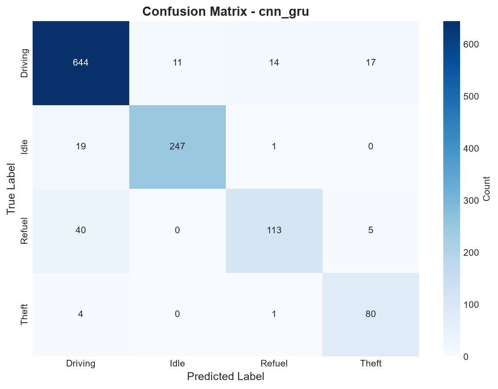

Ma trận nhầm lẫn cho thấy đường chéo chính chiếm phần lớn số lượng mẫu, thể hiện khả năng phân loại đúng của mô hình.

Hai lớp có kết quả nổi bật là **Driving và Idle**. Driving có 644/686 mẫu được phân loại chính xác, trong khi Idle có 247/267 mẫu được phân loại chính xác.

Đối với Refuel, 40 mẫu bị phân loại thành Driving. Đây là cặp nhầm lẫn lớn nhất trong ma trận. Điều này phù hợp với đặc điểm dữ liệu khi một số trường hợp Refuel có mức thay đổi nhiên liệu chưa đủ rõ ràng để tạo thành một pattern riêng biệt.

Đối với Theft, 80/85 mẫu được nhận diện chính xác. Chỉ có 5 mẫu bị phân loại sang các lớp khác. Kết quả này cho thấy mô hình có khả năng nhận diện tốt đặc trưng của sự sụt giảm nhiên liệu bất thường.

---

### 4.10. Phân tích Learning Curve

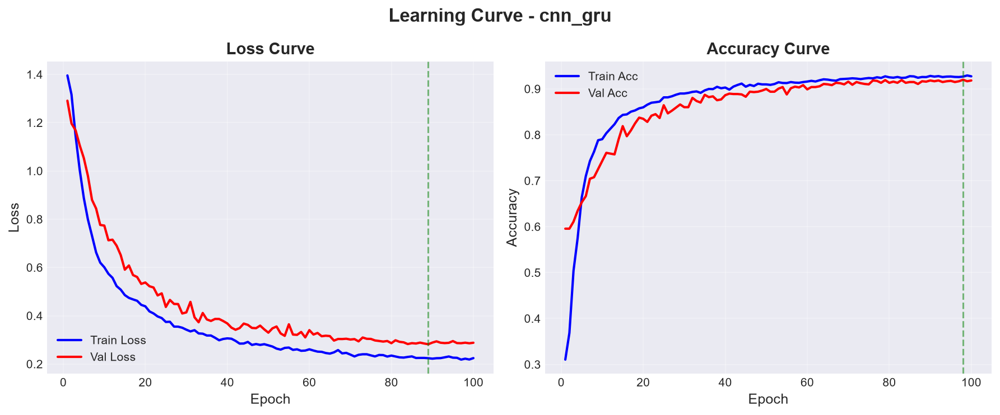

Learning Curve được sử dụng để theo dõi sự thay đổi của Loss và Accuracy trên tập Training và Validation trong quá trình huấn luyện.

Ở giai đoạn đầu, Training Loss giảm nhanh đồng thời Training Accuracy tăng. Khi số Epoch tăng, tốc độ cải thiện giảm dần và mô hình tiến tới trạng thái ổn định.

Validation Loss và Validation Accuracy được sử dụng để kiểm soát khả năng tổng quát hóa của mô hình. Cơ chế **Early Stopping với patience = 15** được sử dụng nhằm hạn chế việc tiếp tục huấn luyện khi hiệu năng Validation không còn cải thiện.

Mô hình cuối cùng được huấn luyện trong **77 Epochs**. Kết quả Test đạt Accuracy 90,64%, cho thấy quá trình huấn luyện đã tạo ra mô hình có khả năng tổng quát hóa tốt trên tập dữ liệu chưa sử dụng trong quá trình cập nhật trọng số.

---

### 4.11. Đánh giá tổng thể mô hình

Dựa trên kết quả thực nghiệm, mô hình CNN-GRU cuối cùng đạt:

* **Accuracy: 90,64%**
* **Balanced Accuracy: 88,01%**
* **F1 Macro: 87,72%**
* **F1 Weighted: 90,52%**
* **ROC-AUC: 96,82%**
* **Cohen's Kappa: 0,8419**
* **MCC: 0,8428**

So với kết quả benchmark ban đầu của CNN-GRU, mô hình cuối cùng đã có sự cải thiện rõ rệt. Đặc biệt, Balanced Accuracy tăng từ **65,46% lên 88,01%**, cho thấy khả năng nhận diện các lớp không chỉ được cải thiện về mặt tổng thể mà còn trở nên cân bằng hơn.

F1 Macro tăng lên **87,72%**, phản ánh hiệu năng giữa các lớp đã được cải thiện đáng kể. Trong đó, Idle đạt F1 **94,10%**, cho thấy vấn đề nhận diện trạng thái dừng đã được cải thiện rõ rệt so với phiên bản trước.

Theft đạt Recall **94,12%**, cho phép mô hình phát hiện phần lớn các trường hợp mất nhiên liệu trong tập Test.

Tuy nhiên, Refuel vẫn có Recall thấp hơn các lớp còn lại, đạt **71,52%**. Đây là hạn chế chính còn tồn tại trong mô hình cuối cùng. Các trường hợp Refuel có biên độ tăng nhiên liệu nhỏ hoặc thời lượng ngắn vẫn có khả năng bị phân loại thành Driving.

**Bảng 4.8. Tổng hợp ưu điểm và hạn chế của mô hình cuối cùng**

| Tiêu chí               | Kết quả đánh giá                                 |
| ---------------------- | ------------------------------------------------ |
| Accuracy tổng thể      | **90,64% – đạt mục tiêu >90%**                   |
| Balanced Accuracy      | **88,01% – khả năng phân loại giữa các lớp tốt** |
| Driving                | F1 = **92,46%**                                  |
| Idle                   | F1 = **94,10%**                                  |
| Refuel                 | F1 = **78,75%**, còn dư địa cải thiện            |
| Theft                  | Recall = **94,12%**, khả năng phát hiện tốt      |
| ROC-AUC                | **96,82%**                                       |
| Mất cân bằng dữ liệu   | Được cải thiện đáng kể                           |
| Khả năng tổng quát hóa | Tốt trên tập Test                                |
| Hạn chế chính          | Nhầm lẫn Refuel → Driving                        |

---

## 5. Hệ thống thời gian thực (Real‑time Inference)

### 5.1. Luồng xử lý online

Mỗi điểm dữ liệu mới được đưa vào Buffer → Sliding Window → Feature Extraction → Model → State Probability → Event Tracker.

### 5.2. Event Tracker và vòng đời sự kiện

**Vòng đời:** Normal → Candidate → Confirmed → Finished.

- **Candidate:** Khi model dự đoán một trạng thái mới với confidence > ngưỡng, hệ thống theo dõi nhưng chưa kết luận.
- **Confirmed:** Khi đạt đủ số lượng dự đoán liên tiếp vượt ngưỡng, sự kiện được xác nhận.
- **Finished:** Khi trạng thái trở về ổn định, sự kiện kết thúc và sinh Event Record.

Dashboard hiển thị rõ vùng Candidate và Confirmed theo thời gian thực.

### 5.3. Boundary Refinement (Backtracking)
Do có Detection Delay, sau khi xác nhận sự kiện, hệ thống quay ngược lại Buffer để xác định chính xác:
- **Thời điểm bắt đầu thật** (dựa trên dấu hiệu vật lý: delta fuel, tốc độ).
- **Thời điểm kết thúc thật**.
- **Lượng nhiên liệu thay đổi thực tế**.
    
### 5.3.1. Adaptive Sliding Window – Cơ chế điều chỉnh kích thước cửa sổ động

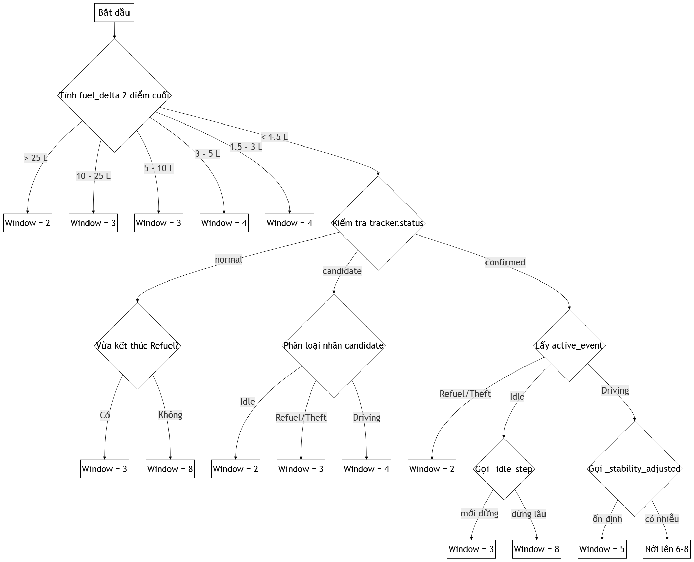

**Mục đích:**  
Adaptive Sliding Window thay thế cho kích thước cửa sổ cố định. Cửa sổ dữ liệu không còn là một số điểm cố định mà tự động thay đổi kích thước dựa trên trạng thái hiện tại của phương tiện và mức độ biến động của tín hiệu nhiên liệu.

#### 5.3.1.1. Nguyên tắc hoạt động

**Bước 1: Tính toán mức độ biến động nhiên liệu**  
Hệ thống tính toán `fuel_change_rate` dựa trên 2 điểm dữ liệu cuối cùng trong Buffer:

```
fuel_change_rate = abs(fuel[-1] - fuel[-2])
```

**Bước 2: Co nhỏ cửa sổ khi phát hiện biến động mạnh**  
Nếu `fuel_change_rate` vượt các ngưỡng, kích thước cửa sổ được điều chỉnh như sau:

| Ngưỡng biến động          | Kích thước cửa sổ | Ghi chú                        |
| ------------------------- | ----------------- | ------------------------------ |
| `fuel_change_rate > 25.0` | 2 điểm            | Refuel/Theft rõ ràng           |
| `fuel_change_rate > 10.0` | 3 điểm            | Biến động lớn                  |
| `fuel_change_rate > 5.0`  | 3 điểm            | Bậc trung gian                 |
| `fuel_change_rate > 3.0`  | 4 điểm            | Biến động vừa                  |
| `fuel_change_rate > 1.5`  | 4 điểm            | Biến động nhẹ                  |

#### 5.3.1.2. Điều chỉnh theo trạng thái của Event Tracker

**Trạng thái `normal`**  
- Mặc định: cửa sổ = **8 điểm**.  
- Nếu vừa kết thúc sự kiện Refuel (cờ `_post_refuel_flag`): cửa sổ được nén xuống **3 điểm** để nhanh chóng bắt trạng thái Idle.

**Trạng thái `candidate`**  
Cửa sổ được nén nhỏ để bắt kịp tín hiệu chuyển pha:

| Loại candidate      | Kích thước cửa sổ |
| ------------------- | ----------------- |
| Idle                | 2 điểm            |
| Refuel / Theft      | 3 điểm            |
| Driving / chưa rõ   | 4 điểm            |

**Trạng thái `confirmed` / `finished`**  
Kích thước cửa sổ được điều chỉnh dựa trên loại sự kiện đã xác nhận:

- **Refuel / Theft:** Giữ cửa sổ ở mức tối thiểu **2 điểm** để bám sát biến động nhanh nhất.  
- **Idle:** Gọi hàm `_idle_step` để tăng dần kích thước cửa sổ theo thời gian dừng: **3 → 4 → 6 → 8 điểm**. Cơ chế này giúp chống nhiễu khi Idle kéo dài.  
- **Driving:** Gọi hàm `_stability_adjusted` để nới rộng cửa sổ dựa trên độ ổn định của confidence:  
  - Confidence ổn định (độ lệch chuẩn thấp): giữ cửa sổ nhỏ **5 điểm**.  
  - Có dao động: nới rộng dần lên **8 điểm** để làm mịn nhiễu.

### 5.4. Event Validation và Event Record
Sự kiện sau Backtracking được kiểm tra theo các quy tắc nghiệp vụ (Confidence, Fuel Change, Duration). Nếu hợp lệ, hệ thống sinh Event Record hoàn chỉnh:

```json
{
  "event": "Refuel",
  "start_time": "09:00:20",
  "end_time": "09:01:10",
  "fuel_before": 30.3,
  "fuel_after": 45.0,
  "fuel_change": 14.7,
  "duration": 50,
  "confidence": 0.96,
  "location": "Gas Station"
}
```

---

## 6. Dashboard và API

### 6.1. Dashboard
Dashboard gồm hai biểu đồ chính:
- **Fuel – Speed Timeline:** hiển thị Fuel, Speed, các vùng Candidate/Confirmed Event.
- **Event Lifecycle:** theo dõi vòng đời sự kiện realtime với confidence và trạng thái (Normal, Candidate, Confirmed, Finished).

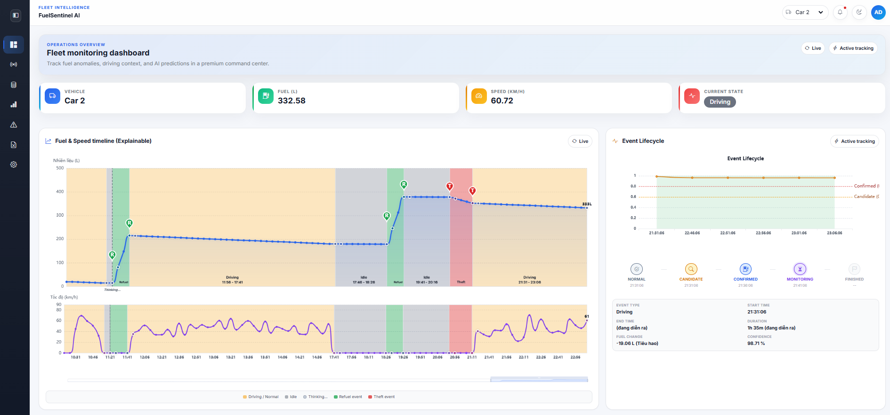  
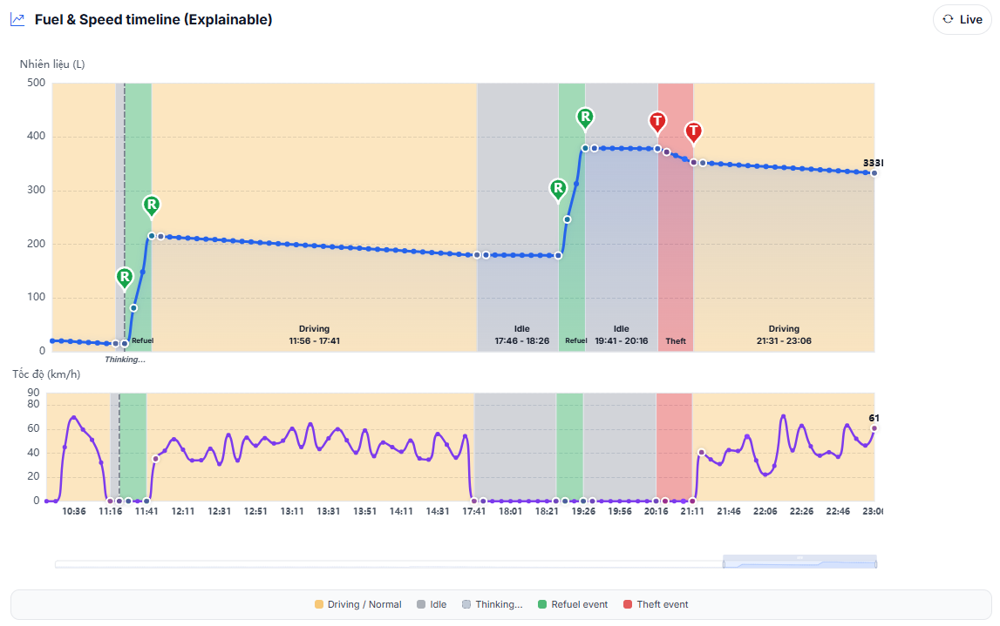  
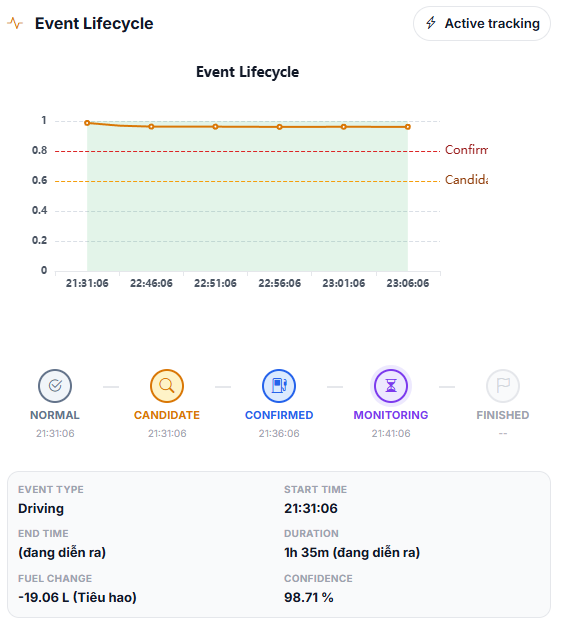

### 6.2. REST API
- `POST /sensor`: nhận dữ liệu cảm biến, trả về trạng thái dự đoán.
- `GET /events`: danh sách sự kiện đã phát hiện.
- `GET /report`: tải báo cáo Excel.

### 6.3. Báo cáo Excel
Báo cáo xuất dạng Excel với các cột: Thời gian bắt đầu, Thời gian kết thúc, Nhiên liệu bắt đầu, Nhiên liệu kết thúc, Thay đổi nhiên liệu, Thời lượng, Tốc độ thay đổi (L/h), Loại sự kiện, Độ tin cậy (%).

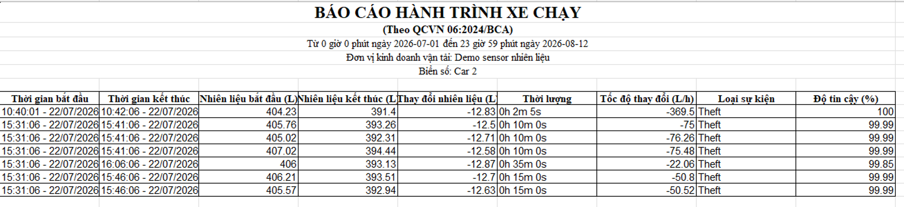

---

## 7. Kết luận và hướng phát triển

### 7.1. Kết luận
FuelSentinel-AI đã xây dựng thành công một pipeline hoàn chỉnh từ tiền xử lý dữ liệu đến hệ thống thời gian thực. Mô hình CNN‑GRU đạt độ chính xác 90.64%, Balanced Accuracy 88.01%, và khả năng phát hiện Theft với Recall 94.12%.

### 7.2. Hướng phát triển
- Thu thập thêm dữ liệu Idle thực tế để cải thiện Recall.
- Thử nghiệm các mô hình Transformer/LSTM cho Time Series.
- Tích hợp Kalman Filter hoặc Wavelet Denoising cho tầng xử lý tín hiệu.
- Triển khai Docker và MQTT streaming cho quy mô lớn.

---

*Báo cáo này được tổng hợp từ quá trình thực tập và kết quả thực nghiệm trên bộ dữ liệu mẫu gồm 4 xe.*